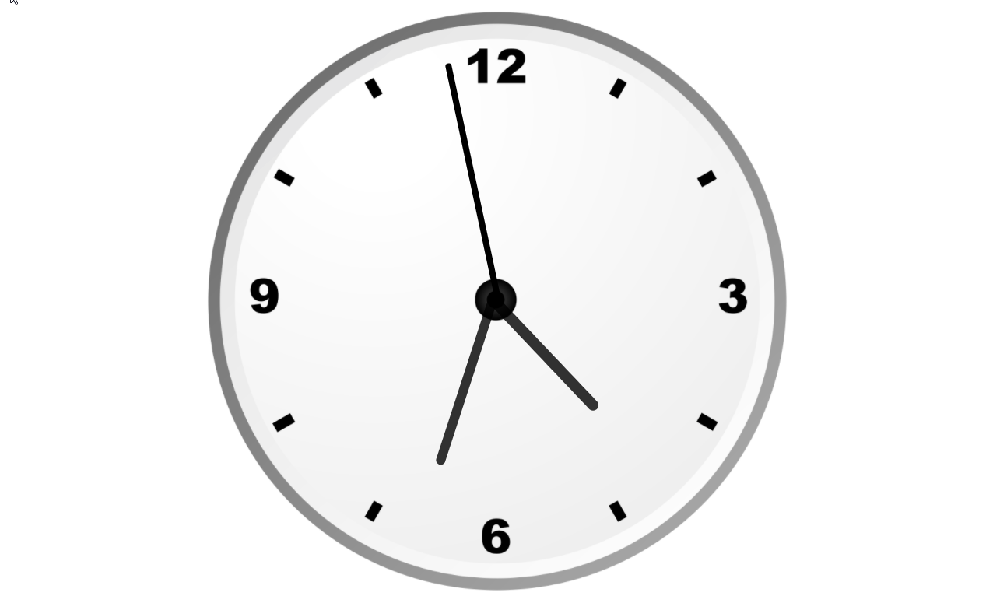

# Clock using Javascript

## About 
This is responsive webpage of working analog Clock using Javascript, Css, Html. 
 
## Demo 

## How to use this Project 
Download project and open index.html file in a browser 

###Motivation
Youtube channel: CodeWithHarry
